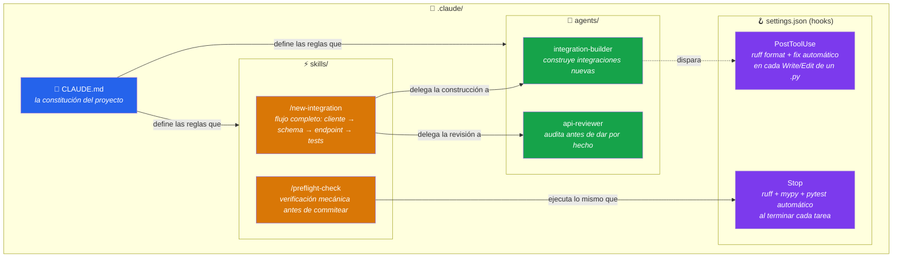

# 💱 Cambio Hoy

Conversor USD → COP con la TRM oficial (Superintendencia Financiera de Colombia, vía [datos.gov.co](https://www.datos.gov.co/)) y el precio de Bitcoin en pesos, vía [CoinGecko](https://www.coingecko.com/).

Este repo es también la demo en vivo de la charla **"Construye tu propio ejército de agentes: Claude Code para tu proyecto Python"** — PyDay Boyacá 2026. El historial de commits muestra el antes y el después de configurarle a Claude Code un arsenal de disciplina de ingeniería (`.claude/`).

```
170d31c  Base: conversor USD/COP con TRM oficial, sin arsenal .claude
3c5dde4  feat: arsenal python          ← Claude construye .claude/ con un solo prompt
dab8b79  feat: bitcoin                 ← misma integración, ahora con disciplina
```

---

## 🚀 Arranque rápido

```bash
uv sync --all-extras
uv run uvicorn app.main:app --reload --app-dir src
```

Abre [http://127.0.0.1:8000](http://127.0.0.1:8000).

## 📁 Estructura

```
src/app/
├── main.py                     # FastAPI: home (HTML), /convertir, /trm, /bitcoin, /health
├── schemas.py                   # Contratos Pydantic de request/response
├── http_client.py               # Cliente HTTP compartido con retry/backoff (httpx + tenacity)
└── integrations/
    ├── trm_client.py            # Integración con la TRM oficial
    └── coingecko_client.py      # Integración con CoinGecko (precio de Bitcoin)
```

## 🌐 Endpoints

| Endpoint | Qué hace |
|---|---|
| `GET /` | Página HTML con el conversor USD→COP y el precio de Bitcoin |
| `GET /convertir?monto=100` | Convierte USD a COP (HTML) |
| `GET /trm` | TRM vigente (JSON) |
| `GET /bitcoin` | Precio de Bitcoin en USD y COP (JSON) |
| `GET /health` | Health check |

## 🛠️ Comandos

```bash
make dev          # servidor con reload
make test          # pytest
make lint          # ruff check
make typecheck     # mypy --strict
make check         # lint + typecheck + test
```

---

## 🧠 El arsenal: `.claude/`

Todo lo de esta sección **no lo escribí archivo por archivo**: se lo pedí a Claude Code en una sola instrucción en lenguaje natural ([ver el prompt exacto](#-prompt-2--construir-el-arsenal)), y decidió sola qué piezas necesitaba y cómo configurarlas.



### ¿Para qué sirve cada pieza?

| Pieza | Tipo | Se activa | Propósito |
|---|---|---|---|
| [`CLAUDE.md`](.claude/CLAUDE.md) | Reglas | Siempre, como contexto de fondo | Define el stack obligatorio (uv, httpx, tenacity, Pydantic v2, ruff, mypy --strict, pytest+respx), el patrón exacto para construir una integración nueva, y las reglas de seguridad no negociables (nunca loguear secretos, nunca silenciar hallazgos `S` de ruff sin justificar). Es lo único que Claude lee *siempre*, sin que se lo pidas. |
| [`agents/integration-builder.md`](.claude/agents/integration-builder.md) | Agente especializado | Cuando se pide agregar/modificar una integración a una API externa | Construye el cliente, el schema, el endpoint y los tests siguiendo `CLAUDE.md` al pie de la letra. Antes de escribir código, **relee el patrón vigente** en `trm_client.py` — no asume, verifica. |
| [`agents/api-reviewer.md`](.claude/agents/api-reviewer.md) | Agente especializado | Antes de dar una integración por terminada | Audita (no edita) el resultado: contrato del cliente, manejo de errores, tipado, seguridad, cobertura de tests. Reporta hallazgos por severidad — o dice explícitamente "todo limpio" si no encuentra nada. |
| [`skills/new-integration`](.claude/skills/new-integration/SKILL.md) | Skill (`/new-integration`) | Se invoca para agregar un indicador financiero nuevo | El checklist operativo completo: investigar la API real → delegar a `integration-builder` → revisar con `api-reviewer` → verificar contra la API real (no mockeada) → actualizar este README → `make check`. |
| [`skills/preflight-check`](.claude/skills/preflight-check/SKILL.md) | Skill (`/preflight-check`) | Antes de cerrar cualquier tarea o hacer commit | Corre `make check` (lint + tipos + tests), corrige lo que falle, y no permite silenciar errores con `# noqa` o `skip` sin justificación. No hace commit — deja el árbol verde y reporta. |
| `settings.json` → hook `PostToolUse` | Hook automático | En cada `Write`/`Edit` sobre un `.py` | Corre `ruff format` + `ruff check --fix` sobre el archivo que se acaba de tocar. Sin que nadie lo pida. |
| `settings.json` → hook `Stop` | Hook automático | Al terminar cada respuesta de Claude | Corre `ruff check` + `mypy src` + `pytest` sobre **todo el proyecto**. Si algo falla, se lo reporta a Claude antes de dar la tarea por cerrada. |

**El punto central:** nada de esto se le pidió a Claude archivo por archivo, herramienta por herramienta. Se le dio el contexto del proyecto y el criterio de "disciplina de ingeniería real, con herramientas estándar de la industria actual" — y decidió el resto.

---

## 🎬 La demo: mismo pedido, dos resultados

La charla reproduce **el mismo prompt** en dos condiciones distintas del repo, para que el contraste se vea en vivo, no se cuente de palabra.

### Paso 0 — Punto de partida

Repo en el commit base (`170d31c`), sin `.claude/`:

```bash
git checkout 170d31c   # o el estado equivalente sin .claude/
uv run uvicorn app.main:app --reload --app-dir src
```

### 🅰️ Prompt A — Bitcoin **sin** arsenal

```
Agrega un nuevo cliente de integración para la API pública de CoinGecko
que obtenga el precio actual de Bitcoin en USD, conviértelo a pesos
colombianos usando nuestra integración con la TRM que ya existe, y
muéstralo en la página principal junto al conversor de moneda.
```

**Qué observar:** el código puede salir razonable o no — eso no es lo importante. Lo que sí es 100% verificable: ¿corrió algo automáticamente al terminar? ¿hay un hook validando lint/tipos/tests? ¿alguien más revisó el resultado antes de darlo por bueno? Sin `.claude/`, la respuesta a las tres es no — pase lo que pase con el código.

**Revertir antes de seguir:**
```bash
git checkout -- .
git clean -fd
```

### 🅱️ Prompt B — Construir el arsenal

```
Este proyecto ("Cambio Hoy") construye integraciones a APIs externas en
Python para mostrar indicadores financieros reales. Configura un arsenal
de Claude Code para él, usando las herramientas y convenciones estándar
de la industria Python actual (no herramientas legacy): las reglas de
cómo deben construirse las integraciones aquí, un par de agentes
especializados, skills reutilizables para el flujo de trabajo, y hooks
de automatización — lo que consideres necesario para que el proyecto
tenga disciplina de ingeniería real.
```

Esto es lo que generó todo lo documentado en la sección [El arsenal](#-el-arsenal-claude) de arriba.

### 🅲️ Prompt A otra vez — Bitcoin **con** arsenal

Exactamente el mismo prompt del paso 🅰️, pegado de nuevo — ahora con `.claude/` presente.

**Qué cambia, de forma garantizada:**
- El hook `PostToolUse` formatea y corrige el código con `ruff` en cada archivo que se toca.
- El hook `Stop` corre `ruff check` + `mypy --strict` + `pytest` automáticamente al terminar — y si algo falla, Claude se entera antes de decir "listo".
- El cliente sigue el patrón exacto de `trm_client.py` (constante `_URL`, usa `http_client.get_json`, deja propagar `httpx.HTTPError`) — porque `CLAUDE.md` lo exige, no porque le tocó adivinar.
- Hay tests en `tests/test_coingecko_client.py` y casos nuevos en `tests/test_main.py`, mockeados con `respx` — obligatorio según el skill, no opcional.

Refresca `localhost:8000` — el precio de Bitcoin en pesos aparece junto al conversor.

---

## 📝 La idea de fondo

El objetivo no era que Claude escribiera Python — para eso ya es bueno por defecto. Era darle el mismo criterio de ingeniería que usa un equipo humano serio: qué patrón seguir, qué verificar antes de terminar, y quién audita el resultado. Ese criterio se puede llevar a **cualquier proyecto Python nuevo**: copia la carpeta `.claude/` completa, ajusta `CLAUDE.md` al dominio nuevo, y el resto ya está listo.
